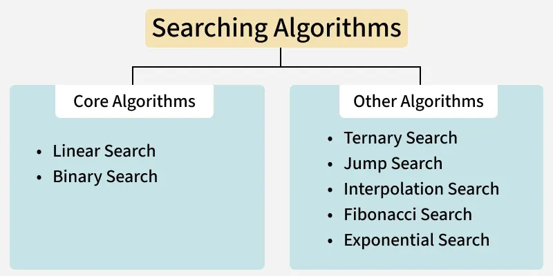

# Introduction to Searching

<p>Searching is the fundamental process of locating a specific element or item within a collection of data. This collection of data can take various forms, such as arrays, lists, trees, or other structured representations.</p>



### Basic Searching Algorithms:
<p> Linear Search – O(n) Time and O(1) Space
It is the simplest searching algorithm that checks each element sequentially until the key is found or the collection is fully traversed. Works on both <u><b>sorted and unsorted data</b></u>.</p>

>For example: Consider the array arr[] = {10, 50, 30, 70, 80, 20, 90, 40} and key = 30

``` python
def search(arr, x):
    n = len(arr)
    
    # Iterate over the array in order to
    # find the key x
    for i in range(0, n):
        if (arr[i] == x):
            return i
    return -1

if __name__ == "__main__":
    arr = [2, 3, 4, 10, 40]
    x = 10

    result = search(arr, x)
    if(result == -1):
        print("Element is not present in array")
    else:
        print("Element is present at index", result)
```

### Binary Search – O(log n) Time and O(1) Space
<p>It <u><b>works on sorted arrays</b></u> by repeatedly dividing the search interval in half. If the target matches the middle element, return it; otherwise, continue searching left or right. </p>

> For example: 
Consider the array  arr[] = {2, 5, 8, 12, 16, 23, 38, 56, 72, 91}, and the key = 23.

``` python
# A recursive binary search function. It returns
# location of x in given array arr[low..high] is present,
# otherwise -1
def binarySearch(arr, low, high, x):

    # Check base case
    if high >= low:

        mid = low + (high - low) // 2

        # If element is present at the middle itself
        if arr[mid] == x:
            return mid

        # If element is smaller than mid, then it
        # can only be present in left subarray
        elif arr[mid] > x:
            return binarySearch(arr, low, mid-1, x)

        # Else the element can only be present
        # in right subarray
        else:
            return binarySearch(arr, mid + 1, high, x)

    # Element is not present in the array
    else:
        return -1

if __name__ == '__main__':
    arr = [2, 3, 4, 10, 40]
    x = 10
    
    result = binarySearch(arr, 0, len(arr)-1, x)
    
    if result != -1:
        print("Element is present at index", result)
    else:
        print("Element is not present in array")
```

### Ternary Search – O(log₃ n) Time and O(1) Space
<p>Ternary Search is a variant of binary search that splits the search interval into three parts instead of two. Mostly used in searching unimodal functions.</p>

> For example: Consider the array  arr[] = {9,7,1,2,3,6,10}.

